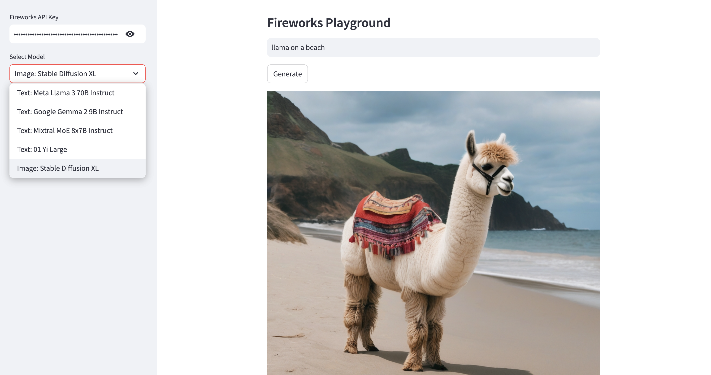

# Fireworks Studio
[Fireworks AI](https://fireworks.ai) is a platform for hosting and running machine learning (ML) models with a cloud API, without having to manage your own infrastructure. Sign up for an account at Fireworks and get an [API key](https://fireworks.ai/settings/users/api-keys), which you'll need for this project. 

This repository showcases a simple Streamlit app for running the following open-source text and image generation models on Fireworks AI:
* 📝 Kimi K2.5
* 📝 MiniMax-M2.5
* 📝 OpenAI gpt-oss 20B
* 📝 Mixtral MoE 8x22B Instruct
* 📝 Deepseek v3.2
* 📝 GLM-5
* 📷 Stable Diffusion XL

For a detailed guide, see [this](https://alphasec.io/running-open-source-generative-ai-models-on-fireworks-ai/) post. To deploy on [Railway](https://railway.app/?referralCode=alphasec) using a one-click template, click the button below.

